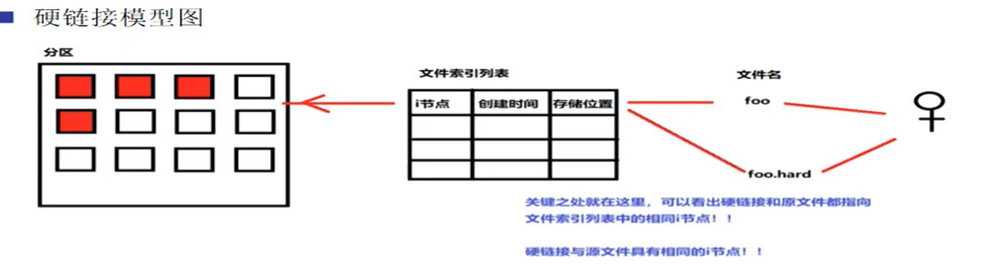
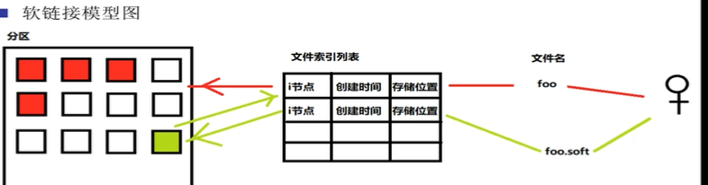

# linux 常用命令

## ls 命令

* -a 显示所有文件包括隐藏的文件
* -l 列出文件的详细列表
* -h 展示友好信息
* -d 查看目录本身的信息，而不是目录下的文件信息
* -i 显示文件的节点信息

## mkdir

* mkdir -p d1/d2 级联创建目录

## rmdir 删除空目录

* rmdir d1
* rmdir d1/d2 删除d1下的d2
* rmdir d1/d2 d1 先删除d1下的d2 再删除d1

## rm 删除文件或目录

* rm -f 文件 强制删除文件
* rm -r 目录 递归删除目录下的文件或目录
* rm 文件，会有确认删除的询问
* rm -rf 目录
  ```
  rm -rf * 删除当前目录下的所有文件  rm -rf /* 删除系统根目录下的所有文件(不要使用它)
  ```

## 文件命令

* more 文件名：分页显示文件内容

> 操作
> 
> > 回车：下一行
> > 空格：下一页
> > b：返回上一页
> > q：退出

* less 文件名：分页显示文件内容

> 参数：-m 显示百分比 -N 显示行号
> 操作跟more一样

* vi 命令

> 一般模式：可以浏览文件内容，进行文件快捷键操作
> 
> > 单行复制：yy
> > 单行粘贴：p
> > 多行赋值：先输入要复制的行数比如4 然后再敲yy
> > 单行删除：dd
> > 多行删除：先输入要复制的行数比如4 然后再敲dd
> > 到行首：shift+^
> > 到行末：shift+$
> > 到最后一行：shift+g
> > 到第一行：gg
> > 到指定那一行：行号+shift+g

## CP命令：复制

* cp 源文件 目标文件
* cp -r 源目录  目标目录

## MV命令：移动

* mv 源文件或目录 目标文件或目录
* mv -f 源文件或目录 目标文件或目录 f表示如果目标位置已经存在则强制覆盖

## 链接命令

* ln -s [原文件] [目标文件] 其中的s表示软连接 软连接相当于window中快捷方式
* 用户通过文件名找到I节点，通过I节点可以找到文件的位置 然后取出文件数据在内存中合并好给用户
* 硬链接特征：

> 1.拥有相同的i节点和存储block块，可以看成是同一份文件
> 2.可以通过i节点识别
> 3.不能跨分区
> 4.不能针对目录使用
> 5.只有一个文件还有硬链接引用它，该文件的其他硬链接的文件即使被删除了数据还是存在的
> 

* 软连接特征：

> 1.类似于windows中的快捷方式
> 2.软连接拥有自己的i节点和block块，但是数据块中只保留源文件的文件名和i节点号，并没有实际的文件数据
> 3.lrwxrwxrwx 其中的l表示软连接，软连接的权限总是rwxrwxrwx
> 4.修改任意文件，另外一个都改变
> 5.删除源文件，软连接不能使用，如果这个时候重新创建回来 软连又可以使用，说明了软连接记的是文件名
> 6.在创建软连接时，要写指定文件的绝对路径(硬链接没有这个要求)
> eg:ln -s /root/a.txt b.txt
> 

* linux 中软连接和硬链接区别

> 创建软连接 ln -s 源文件 目标文件 ；创建硬链接 ln 源文件 目标文件
> 软连接和源文件有不同的i节点，硬链接与源文件有相同的i节点
> 删除源文件后，软连接没法使用 硬链接可以使用
> 创建软件链接时应该指定源文件的决定路径，硬链接没有这个要求

* find 命令

> find [搜索范围] [搜索条件] 避免大范围搜索，因为find会非常消耗系统资源
> find / -name foo   /表示全盘搜索
> find / -iname foo 不区分大小写，按照文件名搜索
> find /var/log -mtime +10 搜索10天前修改的文件
> 
> 1. -10 10天内修改的文件
> 2. 10 当前事件往前退10的那天修改的文件
> 3. +10 10天前修改的文件
> 4. mtime 修改事件  atime 访问事件 ctime 改变文件属性的时间

> find . -size 25k 查找文件大小为25k的文件
> 
> 1. -25k 小于25k的文件
> 2. +25k 大于25k的文件
> 3. +2M 大于2M的文件，这里的M必须是大写
> 
> find . inum 26622 查找i节点为26622的文件
> find /etc -size +20k -a -size -50k  -a 表示and  -o 表示或
> find /etc -size -10k -exec ls -lh {} \;    -exec 命令 {} \;

* 通配符

> ？ 匹配一个任意字符   正则：几列？内容是什么？ 那么？表示有一列 内容任意
> \* 匹配0个或任意多个任意字符，也就是可以匹配任何内容
> [] 匹配中括号中任意一个字符，[] 表示一列
> [-] - 表示范围 匹配中括号中任意一个字符 -表示一个范围
> [^] 逻辑非，表示匹配不是中括号中的一个字符 ^表示排除 eg a[^nm] 表示第二列除了n和m以外的字符都可以
> 注意：通配符必须使用双引号括起来才可以

* grep

> grep 是按照文件内容进行查找
> grep 正则表达式  文件或目录 在指定目录或文件中 返回所有匹配正则式的行
> grep -i 忽略大小写
> grep -v how 排除匹配的行
> grep -n how 打印行号

* 管道  |  前面命令的结果是后面命令的参数
* 压缩和解压缩

> *.tar 打包，大小不会进行压缩
> *.tar.gz 打包并压缩
> tar 命令参数：
> 
> 1. c 建立一个压缩文件
> 2. x 解开一个压缩文件
> 3. z 表示使用gzip压缩
> 4. v 压缩过程中显示文件
> 5. f 使用归档名，在参数f后要立即写出归档名
> 
> 压缩 tar -zcvf 注意：参数顺序不能变
> 压缩 tar -zcvf 压缩包名字.tar.gz  需要压缩的文件
> 解压 tar -zxvf 注意：参数顺序不能变
> 解压 tar -zxvf 压缩包名字.tar.gz -C 指定解压路径

* 查看进程信息

> ps -e 显示所有的进程
> ps -f 完整输出
> ps -ef

* shutdown 命令

> shutdown -r 重启
> shutdown -h 关机(默认是1分钟后关机 这个时候可以打shutdown -c 取消关机)  -c 取消关机
> shutdown -h 05:30 &  表示05：30的时候关机   &表示后台执行

* linux 权限

> linux 权限格式：<类型><用户><组><其他用户>
> 文件类型：d表示目录  - 普通文件  l 软连接文件
> chmod：修改文件或目录的权限
> 
> 1. chmod[参数] [<权限范围><符号><权限代号>]
>    > 参数  -R 表示递归处理，将指定目录下的所有文件及子目录一并处理
>    > 权限范围：u 当前用户 g 当前用户所属组 o 其他用户 a 所有用
>    > 符号： =表示覆盖 +表示追加 -表示撤销权限
>    > 权限代号 r w x

* sed 命令

> sed 命令不用进入文件，在外部修改文件内容
> sed 's/old/new/g' 文件名
> sed 命令并没有真正的修改文件内容，我们看到的结果只是存放于缓存中的结果，如果想要将修改的内容存入文件中，还需要添加一个-i参数  表示插入
> sed /^/& /g  ^表示每一行的开头   &表示添加   $ 表示每一行的末尾
> 在指定内容的下一行后加新的内容

```
sed '/how/a test' test_shell.sh  /a 表示在指定内容的下一行添加内容  /i表示在指定内容的上一行添加内容
```

> 打印指定内容所在的行
> 
> > sed -n '/is/p' 1.txt  其中的p表示打印

> 打印指定的行
> 
> > sed -n '1,5p' 1.txt   打印1-5行
> > grep -v "^\$" 其中^\$ 表示空行   其中\ 表示转义字符
> > sed 's/ /\n/g' 1.txt | grep -v "^$" | sort -nr | sed -n '1p;\$p' 表示将空格替换成换行，把空行删除并且排序 排序完后取出第一行和最后一行

* awk

> 打印文件中指定的列  cat 1.txt | awk '{print $1}'   cat 1.txt | awk -F- '{print \$1}' 其中-F 指定分隔符

* 任务计划crontab

```
"*"表示任何时候都匹配 
可以使用"A,B,C" 表示A或B或C时执行
可以使用"A-B" 表示A-B之间时执行
可以使用"*/A" 表示每过A时段时，都执行一次
```

> 编辑指定用户的计划任务列表  crontab -e -u crontester
> 查看指定用户的计划任务列表
> 计划任务中的echo 会将内容输出到/var/log/cron 文件中
> 全局配置文件 /etc/crontab

## 权限

* 权限对文件的作用

> 对目录有只读权限是没有意义的

```
针对于文件夹
只有r权限：只能看文件夹中的子文件，无法进入文件夹(无法使用cd命令进入)
rx权限：能进入文件夹，能查看文件夹中的所有文件信息
只有x权限：不能查看文件夹中的内容，但是能进入文件夹
w权限：能在文件夹中创建、删除、修改文件
```

## linux软件安装管理

* rmp 包管理

> 全包名：操作的包是没有安装的软件包时，使用全包名，操作已经安装的软件包时，使用包名，所有安装好的软件包，都会存放于/var/lib/rpm的数据库中
> rpm -ivh 包全名

```
-i 安装
-v 显示安装过程
-h 显示进度
```

> rpm -Uvh 包全名 升级rpm包
> rpm -e 包名 卸载
> rpm -qa 显示系统中已经安装的全部rpm软件包
> rpm -q 报名   查询是否安装了某个包
> rpm -qi 已安装的软件包的包名   查询软件包的详细信息 -p 查询未安装包的信息
> rpm -ql 包名  查询包的安装位置

# shell

## 快捷键

```
ctrl + p 上一条命令
ctrl + n 下一条命令
ctrl + b 光标左移
ctrl + f 光标右移
ctrl + d 删除右边字符
ctrl + h 删除左边字符
ctrl + u 删除光标左边的字符串
ctrl + k 删除光标右边的字符串
ctrl + a 行首
ctrl + e 行尾
ctrl + l 清屏
ctrl + r 在历史命令中搜索
```

## 输出重定向

```
命令 > 文件 2>&1  以覆盖的方式，把正确的输出和错误的输出都保存到同一个文件中
命令 >> 文件 2>&1 以追加的方式，把正确的输出和错误的输出都保存到同一个文件中
命令 &>文件 以覆盖的方式，把正确的输出和错误的输出都保存到同一个文件中
命令 &>>文件 以追加的方式，把正确的输出和错误的输出都保存到同一个文件中
命令 >> 文件1 2>>文件2
```

## wc 统计命令

```
wc -c 统计字节数
wc -w 统计单词数
wc -l 统计行数
wc 一次性输出      行数 单词数 字节数
```

## 输入重定向

```
wc < number.txt
```

## 小符号

```
'' 单引号：在单引号中所有的特殊字符，如"$" "`"(反引号) 都没有特殊意义
"" 双引号：，在双引号中特殊符号也没有特殊意义，但是"$" "`"和"\" 是例外，拥有"调用变量" "引用命令" "转义符"的特殊含义
`` 反引号: 反引号括起来的内容是系统命令，在Bash中会先执行它，和$()作用一样，不过推荐使用$()，因为反引号容易看错
$() :和反引号作用一样，用于引用系统命令
$ 用于获取变量的值，如需要调用变量name的值时，可以使用$name的方式获取到变量的值 set命令用于查看定义了哪些变量 unset用于删除变量
\ 转义字符
```

## 用户自定义变量

* 变量名=变量值   =左右不能有空格  变量值中如果有空格，需要使用双引号把变量值括起来

## 环境变量

* export 变量名=变量值 或变量名=变量值   export 变量名
* echo '$((1+1))'     一个括号表示执行系统命令  两个括号表示计算1+1

## 位置参数变量

* \$n n为数字，\$0 代表命令本身，\$1-\$9 代表第一到第九个参数，十以上的参数需要使用${} 进行包含
* \$* 这个变量代表命令行中所有参数，\$* 把所有的参数看成一个整体
* \$@ 这个变量也代表命令行中所有参数，不过\$@把每个参数区分对待
* \$# 这个变量代表命令行中的参数个数

## 预定义变量

* $？ 最后一次命令执行的返回状态，如果这个值是0表示上一个命令执行成功，如果为非0表示上一个命令执行失败
* \$$ 当前进程的进程号
* \$! 显示后台运行的最后一个进程的进程号

## 运算符

* aa=11 bb=22 cc=\$((\$aa+\$bb)) 这样的话  就会把aa和bb相加起来
* aa=11 bb=22 cc=\$[\$aa+\$bb]

## 流程控制语句

* -d 文件：判断文件是否存在，并且是否为目录文件
* -e 文件：判断文件是否存在(存在为真)
* -f 文件：判断文件是否存在，并且是否为普通文件(是普通文件为真)
* test -d kk 然后使用echo $? 获取命令执行的状态 如果是0表示成功如果是非0表示失败
* 或者使用[-d kk] 替换上面的test -d kk
* 简化写法 [-d kk] && echo 'yes'||echo 'no'
* -r 文件 判断文件是否存在，并且是否拥有该文件的读权限(有读权限为真)
* -w 文件 判断文件是否存在，并且是否拥有该文件的写权限(有写权限为真)
* -x 文件 判断文件是否存在，并且是否拥有该文件的执行权限(有执行权限为真)
* 两个文件之间的比较

> 文件1 -nt 文件2 判断文件1的修改时间是否比文件2新(如果新则为真)
> 文件1 -ot 文件2 判断文件1的修改时间是否比文件2旧(如果旧则为真)
> 文件1 -et 文件2 判断两个文件的i节点是否一致，可以理解为两个文件是否为同一个文件，这个方法用于判断硬链接是很好的方法。

* 字符串的判断

> -z 字符串 判断字符串是否为空(为空返回真)
> -n 字符串 判断字符串是否为非空(非空为真)
> -eq 用于数字比较 == 用于两个字符串比较

```
[ 11 -eq 11 ] && echo yes || echo no
```

