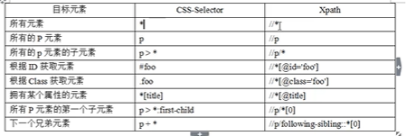

# 虚拟环境的创建

## 创建的方式

> 使用virtualenv
> 使用virtualenvwrapper

* virtualenvwrapper作为virtualenv功能的扩展，可以统一管理虚拟环境(将虚拟环境放到WORKON_HOME目录下)，并且方便我们用单个命令切换不同的虚拟环境、查看所有已创建的虚拟环境等
* pip install virtualenvwrapper-win
* 使用virtualenvwrapper 中的workon 命令进行创建和查看虚拟环境

## 格式化

> 占位符 %d %s %f 等格式化方式

* print("%(name)sAnd%(age)d" % {"name": "hello","age": 90})

> format 格式化

* 按顺序的格式输出

> print("{}And{}".format('hello', 'China'))

> print("{:.2f}".format(3.4455556))

* 不按顺序，指定位置的输出位置

> print("{1}And{0}".format('hello', 'China'))

> 用f标示进行格式化输出
>
> age = 25 print(f"我今年{age}岁")

# 数据类型

> // 地板除的结果是比商小的最大整数 eg：8//-5 = 2 8//5=1

* math模块

> ceil 返回大于等于x的最小整数 如果x是整数则返回x本身
>
> fabs：返回浮点型的绝对值
>
> floor 返回小于或等于x的最大的整数，如果x是一个整数则返回x本身
>
> fsum 主要用于列表或其他可迭代类型的变量，对里面的每个元素求和 返回的值是浮点数

# random 模块

* random.random() 返回[0.0,1.0)之间的浮点数
* random.randint(5,10) 返回[5,10] 之间的整数
* random.randrange(5,10) 返回[5,10) 之间的整数
* random.uniform(5,10) 返回[5,10] 之间的浮点数
* random.choice([1,2,3,4,56,4]) # 从列表中选一个数
* random.shuffle(a) # 随机打乱元素的顺序 没有返回值 原地打乱
* r :在字符串前面加上一个r，就会将该字符串的所有转义字符变成普通字符

# 列表

* 用[]将列表中的元素括起来即可
* '+' 号 将两个列表拼接在一起
* in 用于判断一个元素是否在列表中就可以用该语法
* 求列表中的最大值 max(列表)
* list 方法可以将字符串转化为列表
* append 在列表末尾添加一个元素
* count 统计某个元素在列表中出现的次数
* extend 在列表的末尾一次性添加一个序列的值
* index 从列表中找出第一次匹配的位置
* insert 可以指定插入的位置
* pop 默认删除列表最后一个元素 也可以指定index位置进行删除 并返回删除的元素
* remove 指定要删除元素的值 删除元素 只删除指定元素的第一个
* del  把整个列表进行删除 删除整个变量空间
* reverse 将列表进行逆序输出
* sort 对列表进行排序 sort方法可以接收一个key参数

# 可变数据类型和不可变数据类型

> 不可变：当数据类型的变量的值发生变化时，它对应的内存地址也发生变化 id(变量)

* 字符串 数值型 元组 是不可变

> 可变： 当数据类型的变量的值发生变化时，它对应的内存地址不发生变化 id(变量)

* list 集合用大括号定义{}  字典 是可变

# 元组

> 用小括号定义

> 如果元组只有一个元素的时候，必须在元素后面加一个逗号

# 集合

* 使用大括号定义
* 集合是一个无序且不重复的元素集，集合里面的元素没有位置坐标的,只能用不可变的数据类型作为集合的元素
* 注意1：所有可变的数据类型是不可以哈希的
* set 强制类型转化方法，可以将一个可迭代类型转化为集合(set)
* 集合还支持数学中的关于集合的操作，比如交集  并集  差集

# 字典

* 使用大括号定义 键值对之前用冒号间隔  每个元素之间用逗号隔开
* 如果字典中出现两个相同键的值，则后面的键会替换之前同名键的值
* 值可以是任意数据类型 但是键必须是不可变

> 字典的基本操作

* 直接使用{} 大括号定义
* 访问字典  dic1.get("name") 和 dic1["name"] 都可以
* dic[键值] 如果指定的键存在则修改 如果不存在则新增
* 删除字典中的键值对  del dic1['name']  dic1.pop('name') dic1.popitem() 随机删除一个“键-值”对
* 如果元素与元素之间有映射关系，那么最好选用字典作为容器 如果元素与元素之间没有任何关系相互是独立的最好使用列表
* 求字典的长度：使用len方法 len(字典)
* 字典的深拷贝使用copy方法
* fromkeys 创建一个新的字典，以序列中的元素作为键，也可以指定一个val作为字典的值，如果没有指定val，则默认为None
* in 判断键是否在字典中或者对字典进行循环
* items() 取出字典中所有的键值对
* keys values 分别取出字典中所有的键和 值
* setdefault 可以根据指定键取对应的值，如果键不存在，会添加新键到字典中并将值设定为默认值
* update 使用字典更新字典中的值，如果键不存在怎新增一个新的键 d5.update({"name":"eee",'height':100})
* pop 根据指定的键去删除字典中的键值对 如果键不存在就会报错 可以给一个默认值 不报错
* popitem 随机地删除字典中的一个键值对，一般时字典的末尾开始删
* 使用for i in dict 的语法遍历是默认取的是字典的key

# 条件

* 在python中以下值表示假值：'',None 0 () [] {} False
* break 退出循环   continue 忽略当前项，继续循环
* 当使用break和continue时 只能作用于当前循环，如果当前循环还有父循环，则无法从父循环中continue或break
* 循环中的else  当循环体正常执行完之后，中途没有被break，则else 语句块会执行

# 函数

* 函数默认会返回一个None值(即在不写return语句的前提下)

### 函数的参数

* 就是用户在调用函数时从外部传入的变量，我们可以在函数中任意使用这些变量来进行操作
* 位置参数：调用函数时 根据函数定义时的参数位置来传递参数值，这个就是位置参数
* 关键字参数：通过键值对的形式 进行传递参数 这样可以让函数更加清晰，避免了参数顺序的要求 foo(name="lishi",age=100)

> 如果函数中定义了关键字参数，关键字参数后面就不能再跟位置参数了

* 默认参数，是在函数定义时 给参数的默认值，在调用函数时可以传参数的值也可以不传参数的值,所有位置参数必须出现在默认参数前面
* 可变参数：在函数定义时，可以不确定参数的个数，在调用函数传参时根据实际情况传递n个参数

> foo1(*args,**kwargs) 调用是所有的位置参数被args接收(是一个元组的形式)，所有的关键字参数被kwargs接收(是一个字典形式参数)

* 形参：定义函数时定义的参数
* 实参：调用函数时传递的参数
* 形参和实参的关系：

> 如果传入的实参是可变的参数，那么形参的改变将会影响实参的值，也就是说实参会跟着形参变化 相当于把实参的地址给了形参，
> 实参和形参指向了同一个地址中的值
>
> 如果传入的实参是一个不可变的参数，那么形参的改变将不会影响实参的值 赋值时 相当于把实参的值拷贝了一份给形参

* 变量作用域
* 全部变量，作用于全局，在所有的函数中都可以访问
* 局部变量，也叫本地变量，是指在函数内定义的，只能在函数内部访问
* 如果函数内部的局部变量跟全局变量同名，则局部变量会暂时屏蔽全部变量 如果必须要对全局变量进行重新赋值(=)的时候
  那么在函数内部将全局变量再用global进行声明一次,但是如果全局变量是一个可变数据类型，那么函数内部的修改将会影响全局变量的值
* 匿名函数

> 使用关键字lambda关键字来创建,lambda函数能接收任意数量的参数，但是只能写一句表达式，如果一个函数超过一个表达式，
> 则不适合使用匿名函数来定义，建议使用普通函数
>
> 语法：lambda[参数]:表达式
>
> 使用规则：
>
>> 定义的是单行函数，如果一个函数比较复杂，应该定义为普通函数
>>
>> 可以接受多个参数 不用写return 关键字 也可以没有参数
>>

# 模块

* 所有自我包含并且有组织的代码片段就叫模块，在python的表现形式为一个py文件，其中文件名就是该模块的名字

# 包

* 包是一个有层次的文件目录结构，它定义了有n个模块或n个子包组成的python应用程序的执行环境
* 包在python中就是一个包含_init_.py文件的目录
* 如何区分一个py文件是被作为主程序还是作为一个模块被导入到其他文件中使用？

> 要区分一个文件是作为主程序还是被作为模块被导入，需要用到模块的属性__name__
>
> 如果一个文件作为主程序执行的时候__name__的值为__main__ 如果是被作为模块导入的话,__name__的值为文件名比如py2导入py1 那么__name__值为py1

# pip 管理第三方库

* pip list 查看所有的第三方包
* pip install 安装第三方包
* pip install -i 指定安装时 使用的镜像服务器 比如国内的镜像 install -i https://pypi.douban.com/simple<包名>
* pip install -U<包名> 升级第三方包
* pip uninstall 卸载指定的第三方包
* pip freeze 查看当前python环境中所有已安装的包的版本 可以生成一个requirements文件(pip freeze > requirements.txt)
* pip install  -r 根据requirements文件快速安装第三方包
* 使用 requirements.txt文件 快速的将其他环境备份出来的包安装到现在的环境中(pip install  -r requirements.txt)
* 上面的操作可以保证多个环境中的包版本一致
* pip show <包名> 查看具体包的信息
* pip search<包名> 根据指定的关键字搜索包

# 面向对象

### 类和对象

* 类：就是一群具有相同特征或行为的事物的总称
* 对象：就是类的实例
* 使用dir 查看对象的属性和方法
* 定义类时，如果同一个方法被定义多次 最后的一个会覆盖前面的
* 其中的定义方法中的self  是在对象调用方法时作为隐式的第一个参数进行传递

### 常见的方法类型

* __init__ (self):初始化方法 (对象==实例)

> 不需要显示调用，在初始化一个类(创建对象实例时) 会由python自动调用
>
> 初始化 方法并不是必须的，一般只有在需要定义对象属性时或者继承父类时需要定义__init__ 方法，如果没有定义默认调用终极父类的__init__方法

* 实例化方法(方法的第一个参数为self)

> 实例方法只能通过对象调用
>
> 实例方法在定义时必须以self作为第一个参数
>
> 使用方法在调用时，不需要传入self参数，调用这个方法的实例对象会被隐式传入该方法作为self参数的值

* 类方法

> 可以直接由类名进行调用，也可以通过实例调用
>
> 类方法定义时必须使用@classmethod 装饰器进行修饰
>
> 所有的类方法的第一个参数必须是cls
>
> 不能访问实例属性，只能访问类属性

* 静态方法

> 只能通过@staticmethod装饰器装饰
>
> 静态方法既不能访问实例属性也不能访问类属性
>
> 可以通过类名直接调用也可以通过对象调用

### 属性的种类

* 实例属性

> 跟实例绑定，只能由对象进行访问，不能直接通过类名访问 通过实例方法也可以进行访问

* 类属性

> 不能实例绑定，可以通过类名或实例访问，也可以在实例方法中访问类属性 使用非self.定义的类中属性

## 面向对象的三大特征

### 继承

* 创建一个类A ，如果这个类A继承自类B，那么A类会获取到类B所有的属性和方法，类B叫做类A的父类，类A叫做类B的子类

> 优势：提高代码的重用性，我们不用一遍又一遍的敲那些方法和属性，可以直接通过继承让子类马上获取到父类所有方法和属性
> 可以方便地扩展自己的属性
>
> 当时用继承时，我们必须注意初始化方法__init__的行为：
>
>> * 如果子类没有定义自己的初始化方法，则父类的初始化方法被自动调用,如果要实例化子类对象，必须要传入父类初始化方法对应的参数，否则会报错
>> * 如果子类定义了自己的初始化方法，而在子类中没有显示调用父类的初始化方法，则父类的所有属性都不会被初始化,一般情况下，
>>   如果我们需要在子类中定义子类的属性，则需要在子类中定义初始化方法，否则一般不需要定义自己的初始化方法
>> * 如果子类中定义了自己的属性，在子类中显示调用父类初始化方法，则子类和父类的属性都会被初始化(super().__init__(name,age,stuno)或者Student.__init__(self,name,age,stuno))
>>

* 重新父类的方法

> 如果在子类中定义了跟父类同名的方法，则子类的方法将覆盖父类的方法，实现子类方法的自定义

### 封装

* 概念：将对象的状态信息隐藏在对象内部，不允许外部程序直接访问对象内部的信息，只能通过该类提供的方法来实现对类内部信息进行操作和访问
* 封装的目的

> * 隐藏类的实现细节
> * 让使用者，只能通过预先定义好的方法来访问类内部的信息，我们可以在这些访问方法上加上一些控制逻辑，限制对属性的不合理访问
> * 可以进行数据检查，从而有利于保护对象信息的完整性
> * 便于修改，提高代码的可维护性

* 封装的两个含义：1.将该隐藏的隐藏起来，2.该暴露的暴露出来
* 将对象的属性和实现细节隐藏起来
* 把接口方法暴露出来，让方法来控制对这些属性的安全访问和操作
* 在python代码中实现属性和方法隐藏，在定义的时候使用双下滑线开头__

### 多态

* 如果一个类的子类重写了父类的某一个方法，那么在其他函数取调用这个类的方法时，将根据传入的子类不同呈现出不同的行为
* 父类对象不是一个子类对象，一个子类对象就是一个父类对象 可以使用isinstance 加以判断 python动态语言 鸭子模型 看起来像鸭子
* 多态实现了著名的开闭原则  开放：允许任意新增的Animal类型； 闭：对修改封闭，不需要修改依赖Animal类型的say方法

# 文件操作

## 文本文件操作

* f = open(文件路径,mode='r') 打开一个文件，f.close() 关闭文件
* 文件的打开模式：
*

> * r 只读 不主动生产文件，从文件的开头开始读 rb 已二进制的形式打开
> * r+ 读写 不主动生成文件，从文件的开头读或写
> * w 只写，主动生成文件，清空以前的内容，从头开始写
> * w+ 写读，主动生成文件，清空以前的内容，从头开始写
> * a 追加只写，主动生成文件，从文件末尾开始写内容
> * a+ 追加读写，主动生成文件，从文件末尾开始读或写内容

## 读取数据

* read 按照指定的字符数进行读取，或者一次性读取所有的数据 只适合读取比较小的文件或者不需要单独对每行文字进行处理。
* readline：按行读取文件内容，每次读取一行
* readlines: 一次性读取文件所有内容并以列表的形式返回，每行文字就是列表中的一个元素
* with：通过with关键字使用上下文管理器来直接操作文件,可以让上下文管理器帮助我们自动管理文件，不需要我们手动通过代码关闭文件

> * with open(r'file\python.txt', encoding='UTF-8') as f 其中的f 是一个可迭代的对象(文件的一行行数据)

## 写入文件

> * 文件指针：seek(offset,whence):主要是移动文件指针,让文件指针移动到指定的位置，offset指针的偏移量，whence指偏离相对位置，whence为0时是相对于文件开头
>   位置进行位移，当whence为1时，是相对于当前位置进行位移，当whence为2时，是相对于文件末尾位置进行位移。只有当文件是以文本模式打开whence只能取0值，也就是只能
>   相对于文件开头进行位移，如果以*b模式打开的话 whence 可以去 0 1 2

* tell 获取当前指针的位置.
* write：可以直接写入字符串或以二进制模式写入字节串，一般我们保存图片、音频等二进制文件时需要使用write方法
* writelines:可以接受一个可迭代的对象，比如一个列表或元组，把要写入文件的内容放入到元组或列表中即可

# Python 操作数据库

* 安装连接数据库的第三方库，常见的第三方库有pymysql mysql-connector
* pymysql 只适用于py3，如果版本是py2请使用mysqldb。
* 常用的数据库操作

1) 连接数据库
2) 创建一个新的数据库
3) 创建一张表
4) 插入数据
5) 查询数据
6) 修改数据
7) 删除数据

# 异常处理

* 错误大致分为两类

> 语法错误:不属于异常处理范畴

> 运行时错误:Exeception,异常
> 异常处理：通过捕获异常的方式获取这个异常的名称，再通过其他的逻辑代码让程序继续运行，这种根据异常做出的异常处理就叫异常处理
> 异常处理完整的结构
>
>> try:
>> 可能出现的异常代码块 必须的 try 出现后 必须出现except或者finally 父类异常靠后
>> except[(Exception1,Exception2)] [as e]:
>> except:
>> 异常处理代码块2 捕获所有的异常 不能单独写有try才行
>> else：
>> 程序未发生任何异常时执行 有try才行
>> finally：
>> 资源回收，不管是否发生异常最后都会被执
>>
>
> raise 语句自行引发异常

# socket 编程

---

* socket 又被称为套接字，它是基于TCP/IP协议的为不同主机间进行双向进程间通讯的一种编程接口
* socket 连接过程：
  > 1) 服务器监听
  >
  >> 等待连接，实时监听网络连接请求
  >>
  >
  > 2) 客户端进行请求
  >
  >> 客户端套接字提出连接请求 指定要连接的服务器的端口和IP，进行连接
  >>
  >
  > 3) 连接确认
  >
  >> 通过服务器端确认客户端连接，然后服务器端继续处于监听状态，监听别的客户端的请求
  >>
  >
* socket 发送TCP数据流程

> 

* socket 发送UDP数据流程

> 

---

# HTTP

* http 相关特性

> http 通过请求和响应的交换来达成通讯
> http 是无状态的协议，引入cookie和session技术来管理状态
> http 通过cookie来进行客户端的状态管理
> http 使用URL来进行资源定位(url 统一资源定位符) 通常由3部分构成：资源访问机制、存放资源的主机名、资源自身的名字由路径表示 eg:http://www.hao123.com/note
>
>> http:资源访问机制
>>
>> www.hao123.com:访问资源对应的主机名
>>
>> note :资源路径已经资源自身的名称
>>
>
> http 方法：通过方法告诉服务器我们访问的意图
>
>> 主要的有get和post 方法
>>
>
> http:持久链接
>
> 管线化访问

* 用python来模拟http请求的发送和接收
* 原生库中的urllib来实现http请求的发送和接收

> user-agent 用户代理 (http://httpbin.org/ 可以提供检测http请求时的参数)

# 线程和进程

## 进程是资源分配的最小单元、线程是CPU调度的最小单元

* 线程和进程的关系

> 一个线程只能属于一个进程，一个进程有多个线程，每一个进程至少有一个线程(主线程)
> 资源分配给进程，一个进程中的所有线程共享进程中的所有资源
> 线程在执行过程中，需要协作同步，不同进程间的线程需要利用消息同步机制来实现通讯
> 真正执行任务的是线程，它是进程内可调度的实体

> 1.一个进程中必须只要有一个线程(只有火锅桌子，没有人，没有意义)
>
> 2.一个进程中可以包含多个线程(一张火锅桌子可以坐多个人)
>
> 3.不同进程间很难共享数据(一张火锅桌上的菜一般不会端到其他桌子上去吃)
>
> 4.同一进程下，不同线程间的数据很容易共享(一张桌子上的菜可以被多人吃)
>
> 5.创建进程要比创建线程消耗更多的资源
>
> 6.进程间不会相互影响，而相同进程内部如果有一个线程出现异常，则其他所有线程将全部挂掉
>
> 7.同一进程内不同线程使用同一资源时需要加锁(一张桌子设置一根公筷，只有拿到这个公筷的人才能去夹菜，其他没有公筷的人不能夹菜)

* 串行：做完一件事再完成另外一件事，完成任务时间是所有单任务完成的时间和
* 并行：两个或多个事件在同一时刻方式，相当于多个人同时完成多件事情
* 并发：两个或多个事件在同一时间间隔内发生，相当于一个人同时做多件事情，是逻辑意义上的并行
* _thread:这个模块是在python3之前thread模块的重命名，它是比较底层的模块，一般使用
* threading：Python3之后的线程模块，编程中一般使用这个模块来创建线程
* 创建线程

> 通过继承Thread类来创建新线程
>
> 通过Thread类构造器来创建新线程
>
> join方法：让子线程阻塞主线程的执行过程，也就是说使用了join之后，主线程会等待使用了join方法的子线程结束后再往下执行。

## 锁

* GIL = 全局解释器锁  python严格意义上不是多线程，是并发执行交替的执行，一次只有一个活动的线程
* GIL在什么时候会释放锁(一般针对于共同操作的变量)

> 当当前的执行线程在执行IO操作时，会主动放弃GIL
> 当前执行的线程执行了100个字节码的时候，会自动释放GIL
> GIL 全局解释器锁是粗粒度的锁，必须配合线程模块中的锁才能对原子操作进行锁定

* 线程间的通讯

> Event 主要用于通过事件通知机制实现线程的大规模并发
> Condition 主要用于多线程间的轮流交替执行任务
> Queue 主要用于不同线程间任意类型数据的共享

## 多进程

* 进程创建

> 以指定函数作为参数创建进程
>
> 继承Process类创建进程

* 优点：独立运行，互不影响
* 缺点：创建进程代价大
* 多线程优点：效率比较高，不会消耗大量资源
* 多线程缺点：稳定性比较差，一个崩溃后会影响整个进程
* 多进程场景:对于计算密集型任务，比较适合多进程
* 多线程场景：对于IO密集型任务，比如文件读取和爬虫操作(IO 操作大部分时间都是等待，线程间的自动切换)

# 装饰器

* 用来装饰其他函数的，即为其他函数添加特定功能的函数
* 装饰器函数的两个原则

> 1) 不能修改被装饰函数的源码
> 2) 不能修改被装饰函数的调用方式

* 函数即变量

> 函数既可以被调用，也可以作为变量进行赋值
> 函数的本质是一串字符串，这串字符串保存在内存空间中，函数名是指向这个内存空间的地址，也相当于一个门牌号。
>
> 总结：
>
>> 函数名跟变量一样，只是一个变量的标识符，它指向函数定义对应的内存地址
>> 在函数定义中去调用其他函数时，并不会立即调用该函数
>> 在执行一个调用了其他函数的函数时，如果在内存中没有找到被调用函数的定义，程序会报错
>>

* 高阶函数：

> 接受函数名作为参数
>
> 返回值中包含函数名

* 嵌套函数

> 通过def 关键字定义在另外一个函数中的函数叫做嵌套函数

* 装饰器编写基本套路

> 1.定义一个可以接受函数名作为参数的高阶函数
>
> 2.在高阶函数中顶一个嵌套函数，在该嵌套函数中
>
>> 1.封装要添加的功能代码
>>
>> 2.调用作为参数传入的函数名
>>
>> 3.返回嵌套函数的函数名
>>

* 常见的几种装饰器类型

> 1.被装饰函数带有参数
>
> 2.装饰器本身带有参数
>
> 3.被装饰函数带有返回值

## 闭包

* 闭包的作用

> 可以用来在一个函数与一组私有变量间去创建关联关系，在给定函数被多次调用的过程中，
> 这些私有变量能够保持其持久性(保存运行环境与变量的状态)

* 闭包的特征

> 1.必须要有函数的嵌套，而且外层函数必须返回内层函数，外层函数相当于给内层函数提供了一个包装起来的运行环境，在这个
> 包装的运行环境里，内层函数可以完全自己掌握自由变量的值
>
> 2.内层函数一定要用到外层函数中定义的自由变量

## 线程间的通讯机制

* 可以使用queue队列，event condition

## 线程间的消息隔离机制

* threading.local() 研究一下

## 线程池

* concurrent.futures中的ThreadPoolExecutor
* 线程池中常用的方法

> 1.as_completed

>> all_tasks = [executor.submit(get_html, url, "task" + str(url)) for url in urls]
>> for item in as_completed(all_tasks):  # as_completed 是一个生成器
>>
>
> 2.map
>
>> for data in executor.map(get_html, urls, ['a', 'b', 'c']) 按任务的输入顺序输出结果  而as_completed 时按任务的执行时长来输出结果
>>
>
> 3.wait
>
>> wait(all_tasks, return_when=FIRST_COMPLETED)  # 让主线程阻塞 直到指定的条件成立（等待子线程全部执行完之后 才开始执行主线程）
>>

## 进程池

* 使用Pool类来实现进程池
* 使用concurrent_futures模块提供的ProcessPoolExecutor来实现进程池

## 线程同步信号量

* semaphore的使用，控制多线程执行的一把锁

## 可迭代对象

* 只要定义了可以返回一个迭代器的_iter_方法，或者定义了可以支持下标索引的_getitem_方法，那么它就是可迭代对象，通俗讲就是可以通过for循环进行遍历
* 如何判断一个对象是否是可迭代

> 1.isinstance+iterable（collections）
> 2.hasattr+`_getitem_`

## 迭代器对象

* 迭代器对象是实现了__next__和__iter__ 方法(缺一不可)的对象，就叫做迭代器，其中__iter__方法返回迭代器本身，__next__方法不断返回迭代器中的下一个值，直到容器中没有更多的元素时则抛出StopIteration异常，以终止迭代。next(迭代器) 取出下一个元素
* 可以通过iter方法将可迭代对象转换成迭代器eg：a=[1,2,3] a_iter = iter(a)
* 在一段代码中重复迭代迭代器，无法获取到结果,但是可迭代对象没有这个特性，迭代器中元素被迭代出去后将会从迭代器中删除掉。

## 生成器

* 生成器是一个特殊的迭代器，这种迭代器不需要再写__iter__() 和__next__()方法，只需要一个yield关键字即可
* yield 关键字的作用：

> 1.程序每次在代码中遇到yield关键字后返回结果
> 2.保留当前函数的运行状态，等待下次调用，下次调用从上一次返回yield的语句开始处执行后面的语句

* 生成器预激活机制

> 1.send 方法：1.像next方法一样去调用生成器；2.在调用生成器时同时可以给生成器传递数据到生成器内部
> 预激活生成器的两种方法：直接调用next()方法；调用send(None) 方法激活生成器

## 协程

* 协程又被称为微线程，它是一种用户态的轻量线程。在同一线程中不同的子程序之间可以中断执行去执行其他子程序，并且在中断后回来后，可以从中断的地方继续执行，这种调度模式叫做协程

## asyncio 框架(异步IO)

* 异步IO核心就是对IO操作的调度。
* 为什么要使用asyncio？

> 1.web程序--Django，Flask
> 2.爬虫程序--Scrapy

* 使用asyncio来定义协程

> 1.基于@asyncio.corotutine装饰器来定义协程，使用装饰器方式定义的协程，只是将这个函数对象标记为协程对象，实际上，它本质还是一个生成器，但是标记后，实际上可以当成一个协程来使用
> 2. 使用asyncio原生协程定义

* asyncio 几个重要的概念

> 1.event_loop 事件循环 asyncio中开启的一个无限的事件循环，asyncio会自动在满足条件时去调用相应的协程对象，我们只需要将协程对象注册到该事件循环上即可。
> 2.corotutine：协程对象，指一个用async来定义的函数，在调用时不会立即执行，而是返回一个协程对象。协程对象要注册到事件循环，由事件循环进行调用。
> 3.future对象：代表将来执行或没有执行任务的结果。
> 4.task对象：一个协程对象就是一个原生可以挂起的函数，而任务对象则是对协程的进一步封装，其中包含任务的各种状态。task对象是future对象的子类，它可以将corotutine和future联系在一起，将corotutine封装为一个future对象。
> 5.Async/await:python 3.5 之后用于定义协程的关键字，async定义一个协程，await用于挂起阻塞的异步调用接口，其作用类似于yield。

# python魔法方法

* 什么是魔法方法

> 1.类自带的以双下划线开头和结尾的方法
> 2.一般不需要主动调用，由特定的方法或行为触发
> 3.可以通过魔法方法控制类的行为，实现对类的高级控制

* `__repr()__`: 定制对象的显示规则
* `__del__()`: 定制对象的析构方法，就是对象在销毁的时候干些什么事情
* `__new__()`: 负责创建类的实例 `__init__`() 负责初始化类的实例
* 属性管理

> `__dir__()`:查看对象的方法和属性的名字
> `dir()` 一个函数，对__dir__()方法返回值进行排序，并包装为列表
> `__dict__` 是一个字典，当作用于类时，存储所有实例共享变量和函数；当作用于实例时，存储该对象所有属性和值，一般用于动态读取和设置对象的属性
> `__getattribute__(self,xxxx)`:访问对象的任意属性时被调用,不管属性是否存在
> `__getattr__(self,xxx)`:访问对象的xxx属性且该属性不存在时被调用，背后是当出现AttributeError异常时并且未被手工捕获时才会调用
> `__setattr__(self,xxx)`:当对属性xxx赋值是调用
> `__delattr(self,xxx)__`:当删除对象的xxx属性时被调用,不管该属性是否存在都会被调用

## Python中的反射

* 反射的概念

> 通过字符串的形式在运行时动态修改程序的变量、方法及属性的操作，对于反射操作中所有的修改都会在内存中进行，所以它并不会实际修改代码，主要的目的就是提供程序在运行时的灵活性。

> hasattr:输入一个字符串，判断对象中是否有这个方法或属性
> getattr:获取对象属性值或者方法的引用，如果时方法，返回方法的引用，如果时属性，则返回属性的值。如果该属性或方法不存在，则会抛出异常
> setattr：动态添加一个方法或属性
> delattr：动态删除一个方法或属性
>
> eval(expression,globas=None,locals=None): expressions是一个字符串表达式，将计算后的结果进行返回,将普通的字符串转成python可执行的代码
> exec(obj[,globals[,locals]]):obj 是一个代码块或代码对象，没有返回值,将普通的字符串转成python可执行的代码

# 项目

* 127.0.0.1 本机，0.0.0.0 监听任意IP的链接请求

# 爬虫

## session 对象

* 用于保持会话一般用在爬取需要登陆的页面

```
sess = requests.Session()
sess.get("http://httpbin.org/cookies/set?sessioncookiess=12234")
r = sess.get("http://httpbin.org/cookies")
```

## 设置访问代理

* 很多网站会对长时间访问网站的请求进行限制，这也是反爬的手段之一，我们可以通过设置代理IP的方式来规避这种反爬手段

```
proxies = {
    'https': "121.8.215.106:9797"
}
r = requests.get("https://httpbin.org/ip",proxies=proxies)
```

## xpath

* 1.绝对路径：
* 2.相对路径：
* xpath 分析步骤：
* step1：确定一个需要抓取的元素最近的唯一父节点；
* step2：从父节点往下定位直到目标元素为止；
* step3：在chrome里面调试后利用xml库来抓取元素

## BeautifulSoup

* BeautifulSoup库主要支持css-selector选择器
* 标准的选择器

> find_all(name,attrs,recursive,text,**args) 可根据标签名  属性 内容查找文档
>
>> name:根据标签名进行查找：print(soup.find_all('p'))
>>

>> attrs:根据属性查找：print(soup.find_all(attrs={'id':'div1'}))
>>

* CSS选择器：通过select()直接传入css选择器即可完成选择
  

## 正则表达式

* 绝招：.*?
* result3 = re.findall('"BONDCODE":"(\d+)"',content2) 使用() 进行分组 然后提取出目标子字符串

## 常见反爬手段之身份验证

* 使用cookie信息获取数据
  > 1.复制已经登陆成的cookie信息
  > 2.硬登陆：1) requests登陆，发送post请求，需要分析登陆时各个请求参数 过程比较繁琐，较难实现 2)selenium登陆：完全模拟普通用户网页操作，简单方便，劣势： 由于selenium需要对网站数据进行解析渲染，所以速度比较慢
  >
